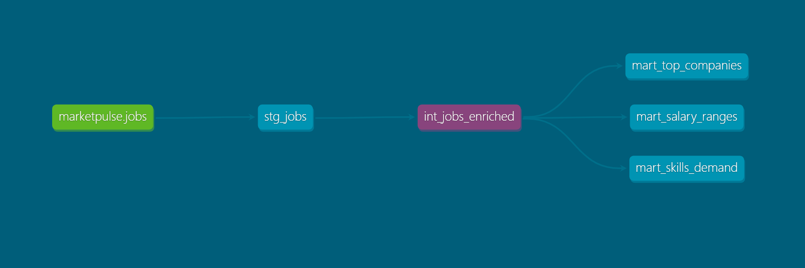

# MarketPulse

MarketPulse is a data pipeline that collects, transforms, and stores 
job postings from across Europe to answer concrete analytical questions: 
what skills are most in demand right now in EU countries? What are the prevailing salaries? Which companies are 
actively recruiting?

I built this project for learning and practice — but from day one, I 
designed it as a real production system, applying the best practices of 
modern data engineering. Every decision in this project had to be 
justified by the problem, not by what's popular or trending. That 
principle shaped the roadmap more than once.

---

## Architecture

### Cloud Architecture (V4 — Current)

```
Adzuna API
    ↓
Airflow Scheduler (Container App)
    ↓
[run_ingestion] PythonOperator
    ├── PostgreSQL Flexible Server (Silver/Gold layer)
    └── Azure Blob Storage (Bronze layer — raw JSON, date-partitioned)
    ↓
[run_dbt_build] BashOperator
    └── az containerapp job start → marketpulse-dbt-job (ephemeral)
            └── dbt build (5 models, 28 tests)
                ↓
         PostgreSQL dbt_dev.* marts
```

**Azure Container Registry:** hosts three Docker images — `marketpulse-airflow`, `marketpulse-app`, `marketpulse-dbt`  
**Azure Container Apps:** runs Airflow webserver and scheduler as always-on services  
**Azure Container Apps Jobs:** runs dbt as an ephemeral task container, triggered by Airflow via Azure CLI  
**Azure Database for PostgreSQL Flexible Server:** persistent storage for raw job postings and dbt marts  
**Azure Blob Storage:** Bronze layer — raw JSON archived per country/keyword/date before PostgreSQL insert  
**Azure Key Vault:** stores all credentials (Postgres, Adzuna API, storage connection string, Fernet key) — injected into containers via Managed Identity  
**Apache Airflow 2.8.1:** orchestrates the full pipeline on a daily schedule via two-task DAG  
**dbt:** transformation layer — cleans, enriches, and materializes analytical models from raw data  

### Local Architecture (V3.5)

```
Adzuna API → Airflow DAG (daily) → ingest.py → PostgreSQL → dbt (staging → intermediate → marts) → FastAPI
                                                                ↑
                                                    DockerOperator spins up
                                                    marketpulse-dbt container,
                                                    runs dbt build, container exits
```

---

## Cloud Deployment (V4)

### Infrastructure — Azure (Spain Central)

| Resource | Type | Role |
|---|---|---|
| `marketpulse-rg` | Resource Group | All V4 resources |
| `marketpulse-postgres` | PostgreSQL Flexible Server (B1ms) | Data store — raw jobs + dbt marts + Airflow metadata |
| `marketpulseacr` | Azure Container Registry | Hosts all three Docker images |
| `marketpulsestorage` | Azure Blob Storage (LRS Standard) | Bronze layer — raw JSON by date |
| `marketpulsekv` | Azure Key Vault (Standard, RBAC) | All credentials — no secrets in code or env files |
| `marketpulse-env` | Container Apps Environment | Shared boundary for all Container Apps |
| `marketpulse-airflow-webserver` | Container App | Airflow UI — external ingress port 8080 |
| `marketpulse-airflow-scheduler` | Container App | DAG scheduling and task execution |
| `marketpulse-dbt-job` | Container Apps Job (Manual) | Ephemeral dbt runner — triggered by Airflow |
| `marketpulse-log-analytics` | Log Analytics Workspace | Container logs and metrics |

### Key Architectural Decisions

**Container Apps Jobs for dbt:** The `DockerOperator` pattern from local development maps directly to Container Apps Jobs in Azure — spin up a container, run a task, exit, pay only for execution time. The Airflow scheduler triggers the job via `az containerapp job start` using its Managed Identity, polls for completion, and marks the task succeeded or failed accordingly. Service isolation is preserved: dbt runs in its own container with its own Python environment.

**Managed Identity over credentials:** All Container Apps authenticate to Key Vault via system-assigned Managed Identity — no passwords stored in container configuration. The trust chain: Container App → Managed Identity → Key Vault Secrets User role → secrets injected as environment variables at startup.

**Bronze layer (Blob Storage):** Raw JSON is archived to Blob Storage before every PostgreSQL insert, path-partitioned as `raw/YYYY/MM/DD/adzuna_{country}_{keyword}_{timestamp}.json`. This enables replay and audit — if the PostgreSQL schema changes, historical raw data can be re-ingested without re-calling the API.

**Medallion architecture:**
- Bronze: Azure Blob Storage (`raw/` container) — immutable raw JSON
- Silver: PostgreSQL `public.jobs` — normalized, deduplicated postings
- Gold: PostgreSQL `dbt_dev.*` — analytical marts ready for consumption

### Secrets Architecture

Seven secrets stored in Key Vault, never in code or environment files:

| Secret Name | What it holds |
|---|---|
| `POSTGRES-USER` | PostgreSQL admin username |
| `POSTGRES-PASSWORD` | PostgreSQL admin password |
| `POSTGRES-DB` | Database name |
| `ADZUNA-APP-ID` | Adzuna API application ID |
| `ADZUNA-APP-KEY` | Adzuna API application key |
| `AZURE-STORAGE-CONNECTION-STRING` | Blob Storage connection string |
| `AIRFLOW-FERNET-KEY` | Airflow encryption key (shared across webserver and scheduler) |

---

## Docker Architecture (Local Development)

The project uses three separate Docker images, each with its own isolated dependency environment:

| Image | Dockerfile | Role |
|---|---|---|
| `marketpulse-airflow` | `docker/airflow/Dockerfile` | Airflow webserver, scheduler, and ingestion script |
| `marketpulse-app` | `docker/app/Dockerfile` | application serving layer |
| `marketpulse-dbt` | `docker/dbt/Dockerfile` | dbt transformation layer — ephemeral task container |

**Why three images?** dbt requires Python 3.10+ while Airflow 2.8.1 runs Python 3.8 in its default image. Installing both in a single image creates irresolvable dependency conflicts. The correct architectural fix is separation: each service owns its own Python environment and its own dependencies. This also maps directly to the Azure deployment model — each image becomes an independently deployable container.

**DockerOperator pattern (local):** The dbt image is not a long-running service. Airflow's `DockerOperator` spins it up as an ephemeral task container after each ingestion run, executes `dbt build`, and tears it down. In Azure this maps to a Container Apps Job triggered via Azure CLI.

**Docker socket proxy:** A `tecnativa/docker-socket-proxy` service exposes the Docker daemon to Airflow over TCP, allowing the DockerOperator to manage containers without mounting the raw Unix socket.

### Local Services

| Service | Image | Description |
|---|---|---|
| `db` | `postgres:15` | Data store for job postings |
| `airflow-db` | `postgres:15` | Airflow metadata database |
| `airflow-webserver` | `marketpulse-airflow` | Airflow UI on port 8080 |
| `airflow-scheduler` | `marketpulse-airflow` | DAG scheduling and execution |
| `airflow-init` | `marketpulse-airflow` | One-time DB migration and admin user creation |
| `app` | `marketpulse-app` | FastAPI on port 8000 |
| `dbt` | `marketpulse-dbt` | Built at compose time, launched on-demand by DockerOperator |
| `docker-proxy` | `tecnativa/docker-socket-proxy` | Docker daemon proxy for DockerOperator |

---

## Stack

| Technology | Version | Role |
|---|---|---|
| Apache Airflow | 2.8.1 | Pipeline orchestration, scheduling, retry and alerting |
| dbt-postgres | 1.11.0 | Transformation layer — staging, intermediate, marts |
| FastAPI | 0.111.0 | REST API exposing stored job data |
| PostgreSQL | 15 (local) / 16 (Azure) | Persistent storage for all job postings |
| SQLAlchemy | 1.4.x | ORM layer between Python and PostgreSQL |
| Docker / Docker Compose | — | Three isolated images — no dependency conflicts |
| Adzuna API | — | Public job postings API covering major European markets |
| Azure Container Apps | — | Managed container platform for Airflow and dbt |
| Azure Container Registry | — | Private Docker image registry |
| Azure Database for PostgreSQL | Flexible Server | Managed PostgreSQL in Azure |
| Azure Blob Storage | — | Bronze layer — raw JSON archive |
| Azure Key Vault | — | Secrets management via Managed Identity |

---

## Getting Started (Local Development)

**1. Clone the repository**
```bash
git clone https://github.com/Ybl04/marketpulse
cd marketpulse
```

**2. Configure environment variables**
```bash
cp .env.example .env
# Fill in: ADZUNA_APP_ID, ADZUNA_APP_KEY, POSTGRES_USER,
# POSTGRES_PASSWORD, POSTGRES_DB, POSTGRES_HOST
```

**3. Build and start all services**
```bash
docker-compose build
docker-compose run --rm airflow-init
docker-compose up -d
```

**4. Access the Airflow UI**

http://localhost:8080

Unpause the `marketpulse_ingest` DAG to activate the daily schedule.

**5. Access the API**

http://localhost:8000/health  
http://localhost:8000/docs

---

## Airflow DAG

The `marketpulse_ingest` DAG runs daily at 07:00 UTC with two sequential tasks:

**Task 1 — `run_ingestion` (PythonOperator)**  
Fetches job postings from the Adzuna API across configured keywords and countries, normalizes the data, and inserts new postings into PostgreSQL with idempotent deduplication. Raw JSON is also archived to Azure Blob Storage before the PostgreSQL insert (Bronze layer).

**Task 2 — `run_dbt_build` (BashOperator)**  
After ingestion completes, Airflow triggers the `marketpulse-dbt-job` Container Apps Job via Azure CLI using Managed Identity authentication. The BashOperator polls for job completion and exits with the correct status code — marking the Airflow task succeeded or failed accordingly. dbt executes all 5 models and 28 tests in dependency order.

```
[run_ingestion] → [run_dbt_build]
 PythonOperator    BashOperator
                   az login --identity
                   az containerapp job start
                   → marketpulse-dbt-job (ephemeral container)
                     dbt build --profiles-dir ... --project-dir ...
```

**Local equivalent (DockerOperator):** In local development, `run_dbt_build` uses `DockerOperator` to spin up the `marketpulse-dbt` container directly via Docker daemon. Same isolation pattern, different trigger mechanism.

Keywords and target countries are configured in `app/config.py`.

---

## dbt Transformation Layer (V3)

V3 adds the analytics backbone to the MarketPulse architecture — a dbt 
transformation layer that sits on top of the Airflow-orchestrated PostgreSQL 
database and prepares data for analytical consumption.

### Layer Structure



**Staging (`stg_jobs`)** — schema evolution firewall. All column selection, type casting, null handling, and renaming happens here.

**Intermediate (`int_jobs_enriched`)** — derives `seniority_level` from job title keywords and `salary_mid` from min/max salary where both are present.

**Marts** — analytical models:
- `mart_top_companies` — hiring volume by company and country, ranked within each country
- `mart_salary_ranges` — compensation ranges by country and seniority level
- `mart_skills_demand` — skill keyword mentions by country and seniority level, with coverage percentage

### Tests

28 generic dbt tests across all 5 models: `not_null`, `unique`, and `accepted_values`. Tests run automatically as part of `dbt build` after every ingestion.

### Data Quality Finding

The Adzuna `description` field contains primarily company descriptions rather than structured skill requirements. Maximum keyword coverage across all postings is ~16% (Python). The `mart_skills_demand` mart exposes this limitation explicitly via `mention_count`, `total_count`, and `coverage_pct` columns — following a data observability pattern rather than hiding the gap.

---

## API Endpoints

### GET /health
```json
{ "status": "ok", "version": "1.0.0" }
```

### GET /jobs/{keyword}
Returns stored job postings matching the keyword.

### GET /jobs/{keyword}/stats
Returns aggregated statistics: total postings, average salary range, top locations.

---

## Roadmap

**V1: Batch ingestion** ✅  
Foundation layer: fetch, normalize, and store job postings in PostgreSQL. FastAPI exposes data via REST endpoints.

**V2: Airflow orchestration** ✅  
Kafka was originally planned here. After evaluating the data flow — a REST API polled on a schedule — Kafka was correctly identified as unjustified complexity. The right next layer was orchestration: Airflow runs the pipeline on a schedule, handles retries, and makes failures observable.

**V3: dbt transformations** ✅  
Transformation layer on top of orchestrated ingestion: five models across three layers (staging, intermediate, marts), 28 passing tests, full lineage, and a formally documented data quality finding in `mart_skills_demand`.

**V3.5: Docker architecture refactor** ✅  
Separated the monolithic image into three isolated images — one per service. Resolved a Python version conflict between Airflow 2.8.1 and dbt-postgres 1.11.0. Integrated dbt into the Airflow DAG via DockerOperator. End-to-end automated pipeline: ingestion and transformation run as a single observable DAG.

**V4: Azure cloud deployment** ✅  
Full end-to-end pipeline deployed to Azure. Three Docker images pushed to Azure Container Registry. Airflow runs as two always-on Container Apps (webserver + scheduler). dbt runs as an ephemeral Container Apps Job triggered by Airflow via Managed Identity — preserving the service isolation architecture from V3.5. Azure Blob Storage adds a Bronze layer for raw JSON archival. All credentials managed via Key Vault with RBAC. DAG confirmed running end-to-end in Azure with green status.

**Known limitation (deferred to V5):** Airflow remote logging to Azure Blob Storage is blocked by an open bug in `apache-airflow-providers-microsoft-azure` (authentication issuer mismatch). Task logs are accessible via Azure Log Analytics in the interim.

**V5: Enhanced skill signal + observability** ⏳  
Integrate a second structured data source to improve skill demand analytics. Add Metabase BI layer on top of dbt marts. Resolve remote logging issue when provider bug is fixed upstream.